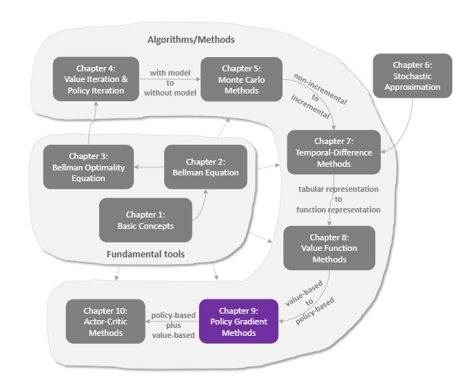

# 强化学习-第九章-策略梯度方法

到目前为止，我们介绍的算法（DQN, Q-learning）都是 **Value-Based** 的：
1.  先算 $Q(s, a)$（动作价值）。
2.  再通过 $\arg\max_a Q(s, a)$ 选动作。

但这有个问题：如果动作空间是连续的（比如机器人关节角度），$\arg\max$ 很难算。而且，我们无法学习到**随机策略**（比如石头剪刀布，必须随机才厉害）。

本章介绍 **Policy-Based** 方法：直接学习策略函数 $\pi(a|s; \theta)$。

## 1. 策略梯度定理 (Policy Gradient Theorem)

我们的目标是最大化期望回报 $J(\theta)$：
$$J(\theta) = \mathbb{E}_{\tau \sim \pi_\theta} [R(\tau)]$$

怎么求梯度 $\nabla_\theta J(\theta)$？
经过一番数学推导（利用 Log-Derivative Trick），我们得到了著名的 **策略梯度定理**：

$$\nabla_\theta J(\theta) = \mathbb{E}_{\pi_\theta} [\nabla_\theta \ln \pi(A_t|S_t; \theta) \cdot Q_\pi(S_t, A_t)]$$

这个公式的直观解释非常漂亮：
-   **$\nabla_\theta \ln \pi(a|s)$**：这是一个向量，指向**增加**动作 $a$ 概率的方向。
-   **$Q(s, a)$**：这是权重。
    -   如果 $Q$ 是正的（好动作）：沿着梯度方向走，**增加**该动作概率。
    -   如果 $Q$ 是负的（坏动作）：沿着梯度反方向走，**减少**该动作概率。

::: info 交互演示：概率搬运 (Probability Shift)
(此处预留交互式组件：一个直方图显示动作概率。当某个动作对应的 Q 值很高时，动画展示该动作的柱子变高，其他柱子被压低。)
:::

## 2. REINFORCE 算法 (蒙特卡洛策略梯度)

既然有了梯度公式，我们就可以用梯度上升来更新参数了。
但是公式里的 $Q_\pi(S_t, A_t)$ 还是不知道啊？

**REINFORCE** 算法说：直接用这一局的实际回报 $G_t$ 来代替 $Q_\pi(S_t, A_t)$！
（因为 $Q$ 本来就是 $G$ 的期望，量纲一样）

更新公式：
$$\theta \leftarrow \theta + \alpha \gamma^t G_t \nabla_\theta \ln \pi(A_t|S_t; \theta)$$

### 算法流程
1.  用当前的策略 $\pi_\theta$ 玩完完整的一局（Episode）。
2.  记录下轨迹：$s_0, a_0, r_1, s_1, a_1, r_2, \dots$
3.  对每一步 $t$：
    -   计算从这步开始的回报 $G_t$。
    -   更新 $\theta$。

## 3. 优缺点分析

| 特性 | Value-Based (DQN) | Policy-Based (REINFORCE) |
| :--- | :--- | :--- |
| **动作空间** | 离散 (Discrete) | **连续 (Continuous)** 或离散 |
| **策略类型** | 确定性 (Deterministic) | **随机性 (Stochastic)** |
| **收敛性** | 振荡 (无保证) | 局部最优 (梯度法特性) |
| **效率** | 样本效率高 (Off-Policy) | 样本效率低 (On-Policy, 需跑完一局) |

REINFORCE 虽然简单，但方差很大（因为用单次 $G_t$ 代替期望）。
如果这一局运气好，$G_t$ 很大，所有动作都被奖励；运气不好，所有动作都被惩罚。这显然不合理。

下一章，我们将介绍 **Actor-Critic**，它结合了 Value-Based (Critic) 和 Policy-Based (Actor) 的优点，用 Critic 来估算 $Q$ 值，从而降低方差。

## 4. 总结

本章我们迈出了“由直觉到数学”的一大步。
不再通过 $Q$ 值间接选动作，而是直接优化策略分布。这是现代大模型（如 RLHF）的基础范式之一。
