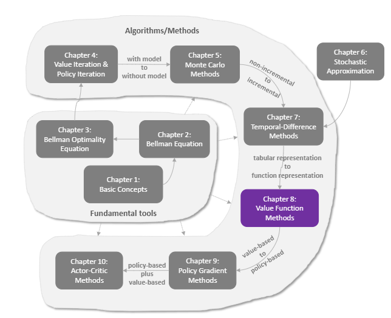

# 强化学习-第八章-值函数近似

迄今为止，我们的 RL 算法都表现完美。但有一个致命的前提：**状态空间都很小**。
之前的例子里，我们用一个**表格 (Table)** 来存储 $v(s)$ 或 $q(s,a)$。每个状态占一行。

但在围棋中，状态数超过宇宙原子总数。在自动驾驶中，摄像头的像素组合更是无穷无尽。
**表格存不下了！怎么办？**

本章引入 **值函数近似 (Value Function Approximation)**，用一个函数 $\hat{v}(s, w)$ 来逼近真实价值。这是通向 **深度强化学习 (Deep RL)** 的大门。

## 1. 维度灾难与函数逼近

如果状态太多，我们就不存表格了，而是存一个函数的**参数 (Weights)**。
$$\hat{v}(s, \mathbf{w}) \approx v_\pi(s)$$

比如，用一个线性函数：
$$\hat{v}(s, \mathbf{w}) = \mathbf{w}^T \mathbf{\phi}(s) = \sum w_i \phi_i(s)$$
其中 $\phi(s)$ 是我们提取的**特征向量 (Feature Vector)**。

更新方式变成了**梯度下降 (Gradient Descent)**：
$$\mathbf{w} \leftarrow \mathbf{w} + \alpha [Target - \hat{v}(s, \mathbf{w})] \nabla \hat{v}(s, \mathbf{w})$$

::: info 交互演示：曲线拟合 (Curve Fitting)
(此处预留交互式组件：给定一些带噪声的样本点（代表真实价值），用户调整参数 $w$，看到拟合曲线 $\hat{v}$ 逐渐逼近样本点。)
:::

## 2. 深度 Q 网络 (DQN)

既然可以用线性函数，那能不能用更强的函数？比如**神经网络 (Neural Network)**？
当然可以！这就是 **Deep Q-Learning (DQN)**。

我们将 $Q(s, a; \mathbf{w})$ 用一个深度神经网络来表示。输入是状态（比如游戏画面），输出是每个动作的 Q 值。

### 两大创新
直接把 Q-learning 和神经网络结合并不稳定，DQN 引入了两个关键技术：

1.  **经验回放 (Experience Replay)**
    -   问题：RL 产生的数据是序列相关的（相邻两帧很像），这违反了神经网络训练“独立同分布 (IID)”的假设。
    -   解决：把数据 $(S, A, R, S')$ 存进一个大池子 (Replay Buffer)，训练时随机抽取。

2.  **目标网络 (Target Network)**
    -   问题：Target $R + \gamma \max Q(S', a; \mathbf{w})$ 里的 $\mathbf{w}$ 也在变。这就像“射移动的靶子”。
    -   解决：固定一个旧的参数 $\mathbf{w}^-$ 用来算 Target，过一段时间再更新。

::: info 交互演示：Replay Buffer 工作流
(此处预留交互式组件：动画展示 Agent 玩游戏产生数据 -> 存入 Buffer -> 随机抽取 Batch -> 输入网络训练的过程。)
:::

## 3. 为什么通过这一章？

这一章是经典 RL 和现代 AI 的分水岭。
-   **前 7 章**：都在讲“表格型 RL”，理论优美，但只能解决玩具问题。
-   **从本章开始**：我们进入了“近似 RL”的世界，虽然理论保障变弱了（不一定收敛），但能力变强了，能玩 Atari、下围棋、控制机器人。

## 4. 总结

| 方法 | 存储形式 | 适用场景 | 优点 | 缺点 |
| :--- | :--- | :--- | :--- | :--- |
| **表格型 (Tabular)** | 数组 / 哈希表 | 小规模离散状态 | 理论保证收敛，精确 | 存不下，无法泛化 |
| **线性近似 (Linear)** | 权重向量 $\mathbf{w}$ | 中等规模 | 训练快，可解释 | 表达能力有限 |
| **深度网络 (Deep)** | 神经网络参数 | 大规模 / 图像输入 | 表达能力强，端到端学习 | 训练不稳定，黑盒 |

下一章，我们将介绍 **策略梯度 (Policy Gradient)** 方法。既然可以用神经网络拟合 $Q$ 值，为什么不直接用神经网络拟合策略 $\pi(a|s)$ 呢？
这就引出了 Policy Gradient 和著名的 Actor-Critic 架构。
