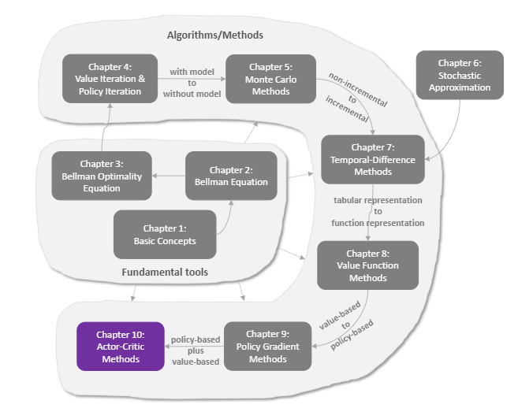

# 强化学习-第十章-演员-评论家方法

上一章我们介绍了 **Policy Gradient (Actor)**：直接优化策略，能处理连续动作，但方差大。
前几章我们介绍了 **Value Approximation (Critic)**：估算价值，方差小，但有偏差。

本章将两者结合，诞生了现代强化学习最强大的算法家族：**Actor-Critic (AC)**。

-   **Actor (演员)**：根据概率选动作。
-   **Critic (评论家)**：给动作打分。

## 1. QAC: 最简单的 Actor-Critic

回顾策略梯度公式：
$$\nabla J(\theta) \approx \mathbb{E} [\nabla \ln \pi(a|s) \cdot Q(s, a)]$$

REINFORCE 算法用 $G_t$（一局的总回报）来近似 $Q$。
Actor-Critic 算法说：为什么不直接训练一个神经网络来近似 $Q(s, a; w)$ 呢？

### 算法流程
1.  **Actor** 选动作 $a$。
2.  环境反馈 $r, s'$。
3.  **Critic** 计算 TD Error: $\delta = r + \gamma Q(s', a'; w) - Q(s, a; w)$。
4.  **Critic** 更新参数 $w$ (最小化 $\delta^2$)。
5.  **Actor** 更新参数 $\theta$ (沿着 $Q$ 指引的方向)。
    $$\theta \leftarrow \theta + \alpha \nabla \ln \pi(a|s) \cdot Q(s, a; w)$$

## 2. A2C: 优势演员-评论家 (Advantage Actor-Critic)

直接用 $Q(s,a)$ 有个问题：如果所有动作的 $Q$ 值都是正的（比如 $[100, 101, 102]$），那么所有动作的概率都会增加，只是增加的幅度不同。这会导致收敛变慢。

我们更关心的是：这个动作**比平均水平好多少**？
这就是 **优势函数 (Advantage Function)**：
$$A(s, a) = Q(s, a) - V(s)$$
其中 $V(s)$ 是状态价值（平均水平），被称为 **Baseline**。

### 怎么算 A(s, a)？
如果又要由神经网络算 $Q$，又要算 $V$，太麻烦了。
我们可以利用 TD Error 的性质：
$$\delta = r + \gamma V(s') - V(s) \approx A(s, a)$$
因为 $r + \gamma V(s')$ 就是 $Q(s, a)$ 的无偏估计！

所以，**A2C 只需要一个 Critic 网络来估算 $V(s)$**。
更新公式变为：
$$\theta \leftarrow \theta + \alpha \nabla \ln \pi(a|s) \cdot \underbrace{(r + \gamma V(s') - V(s))}_{\text{Advantage}}$$

::: info 交互演示：Baseline 减法
(此处预留交互式组件：展示减去 Baseline 后，好动作的 Advantage 变为正，坏动作变为负。梯度更新的方向变得更加明确。)
:::

## 3. Off-Policy Actor-Critic

标准的 A2C 是 On-Policy 的（边跑边学）。如果想利用别人的经验（Off-Policy），需要用到 **重要性采样 (Importance Sampling)**。

这是一个更高级的话题，它允许我们使用 Replay Buffer 来训练 Actor-Critic，进一步提高了样本效率。后续的 DDPG, SAC 等算法都属于这一类。

## 4. 总结

Actor-Critic 方法集百家之长：
-   像 Policy Gradient 一样能处理连续动作。
-   像 DQN 一样能单步更新 (TD)，方差小。

它是目前深度强化学习的主流架构。
-   **A3C / A2C**: 并行训练的 Actor-Critic。
-   **DDPG / TD3**: 确定性策略的 Actor-Critic（用于机器人控制）。
-   **PPO / TRPO**: 限制更新幅度的 Actor-Critic（OpenAI 的最爱）。

下一章，我们将总结全书，并展望强化学习的未来。
